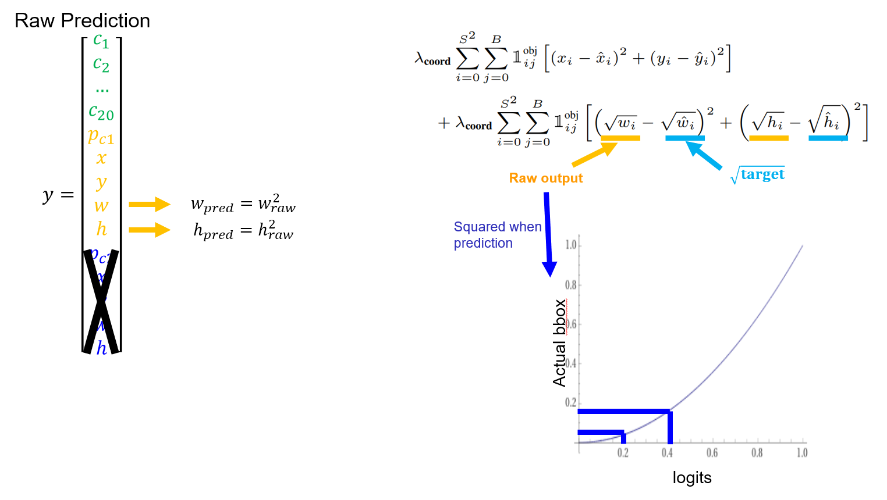

# YOLOv1-pytorch-for-colab

> This is simple and effective implementation of YOLOv1 using pytorch, trainable in "Google Colab" environment.

## Introduction
This is the pytorch implementation of YOLOv1 for study purpose.

Though I've used Aladdin Persson's [YOLOv1 from scratch](https://www.youtube.com/watch?v=n9_XyCGr-MI) video for baseline of this project, <u>I rewrote most of the project by myself</u> including **loss function** and **pretrained model** to raise up performance comparable to the [original paper](https://arxiv.org/abs/1506.02640). Also to refactor it trainable it in Google Colab environment, for those who do not have their own GPU like me. 😂

To train it by yourself, simply clone this repo and upload it on your Google Drive.

## Dependencies
- PyTorch
- numpy
- matplotlib
- pandas
- Albumentations
- torchsummary
- tqdm
- OpenCV (will be installed with Albumentations.) 
- Jupyter Notebook (for local only)

Do not install OpenCV manually as it may cause version conflict with Albumentations.

- If you're using **Anaconda** and **have local gpu**, then simply create new environment and follow the [official guide](https://pytorch.org/get-started/locally/) for installation. 

- If you're on **Google Colab**, just simply run the cell on top of jupyter file. You'll have to run it every time whenever new session in allocated.

## Experiment Result

PascalVOC **2007, 2012 trainval** sets were used for training, and VOC **2007 test** set for validation.

To utilize pre-trained feature extractor network, I tried two different backbone networks `VGG-19` and `Resnet-18` provided by `torchvision`. I was able to reach best mAP of `58.32` which is a bit lower than proposed in the paper. Possibly the difference in backbone network had impacted the performance.

| Backbone |Train Set|Test Set| mAP |
|---|---|---|---|
| Original (paper) | 2007+2012 | 2007 | 63.4 |
| Resnet-18 (mine) | 2007+2012 | 2007 | **58.32** |
| VGG-19 (mine) | 2007+2012 | 2007 | 53.97

## Training Detail

### Loss Function

Because lots of resources explaining about YOLO loss function can easily be found in google, I'm not going to explain about it in full detail here. Still, there is an important point that nobody was dealing.

Below describes how the square root in the loss function is derived. The raw prediction `w, h` from the model is the square root of the actual box that it predicts. Thus,  in loss function actually is the raw output of the model. What about the target? The terms  are the square root of the labels!



I suppose this helps the model to predict smaller boxes more precisely as slight change in box size is critical rather than larger boxes. How did I figured it out...? It can be found from [darknet repository](https://github.com/pjreddie/darknet/blob/master/src/detection_layer.c).

```C
    if (l.sqrt) {
        out.w = out.w*out.w;
        out.h = out.h*out.h;
    }
    float iou  = box_iou(out, truth);
```

### Data Augmentation

I've applied online data augmentation rather than offline one. It made critical difference in preventing overfit. [Albumentations](https://albumentations.ai/) provides powerful functions for it. The jittering pipeline consists of ...
1. 448x448 resize
2. color jittering
3. flip
4. crop
5. gauss noise
6. rotation & translation
7. ImageNet Z-Score normalization
8. ToTensor: numpy (H,W,C) -> pytorch (C,H,W) 

 

Be aware that z-score normalization is applied after this. Also the padding color is `mean` of ImageNet (becomes 0 when normalized).

### Model

I used Resnet-18 and VGG-19 pretrained with `224x224` ImageNet. YOLOv1 uses `448x448` images instead of it. Thus, given `448x448`, the output size of Resnet and VGG will be upscaled to `14x14x512`.
From the paper, the author attached 4 conv and 2 fc layers at the back of pretrained model. See `yolo\resnet_model_light.py` for detailed architecture. Be aware that the output shape of backbone net is different. This may caused difference in performance.

|Backbone|Original|Resnet|VGG|
|---|---|---|---|
|Out Shape|14x14x1024|14x14x512|14x14x512|

## How to use

Simply clone this repo and upload it on your Google Drive. Click `YOLOv1 train.ipynb` and run all cells. Default path is `\Colab Resources\YOLOv1\`

### Preparing Dataset
This model uses YOLO styled label (0~1). Upload compressed set on your drive and **unarchive it in your Colab session storage**. DO NOT UNARCHIVE IN GOOGLE DRIVE. The unarchive script is contained in Notebook file.
- You can download the PascalVOC dataset preprocessed by Aladdin Persson [here](https://www.youtube.com/redirect?event=video_description&redir_token=QUFFLUhqa0FITUk5dU95N2ZUUXRJZm5NZ1lBbnVKVWN1UXxBQ3Jtc0tsVzgxU3pYN3B2WUFrZlVWNm9HV0R5LWtoTE9zY3Z6eW1CYzN3ZTNzb1NfY2t2YTE0ZEMtOG5vOWF6Y1VFUFVST0tMQUtkdVRLMHRWaVpmWUpCZFkxZ0ktZ3R0Q1kwcjg1ZmwtSC04ZWszSWF2eFhPTQ&q=https%3A%2F%2Fwww.kaggle.com%2Fdataset%2F734b7bcb7ef13a045cbdd007a3c19874c2586ed0b02b4afc86126e89d00af8d2&v=n9_XyCGr-MI).
- If you want to create it by yourself, see [here](https://pjreddie.com/darknet/yolo/). You'll need to make `csv` file.

### Training in Colab

Based on my experience, the training will require at least 30 hours which is longer than maximum session length. I've handled unexpected disconnection during training.

While training, all training status will be saved per every epoch. When you are disconnected during training, **simply reconnect to new session and run all cells.** The script will automatically continue training!